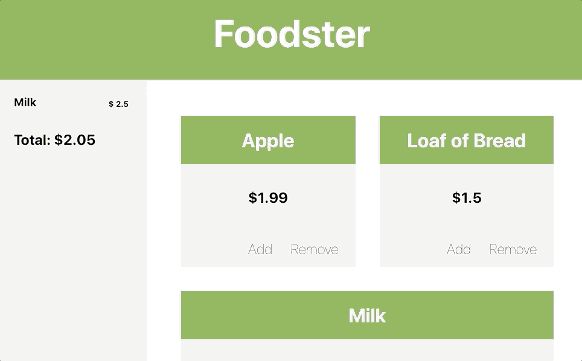

# Create A Grocery App

## The Goal

In this lab, you're going to build the front-end for a digital grocery store! Users will be able to add and remove items to and from their cart and see a live total updated as they make changes.

## The Lab

### Part One: Warm Up

1. Add 2 more items to the inventory on `App.js`. Make sure they have a name and a price.
2. Pass the add and remove functions from `App.js` to `<ProductList/>`.
3. Render all 5 `<Product/>` components in `productList.js`. Pass all props information to `<Product/>`.
4. Print out the name and price in each card
5. Call the add and remove functions when the “Add” and “Remove” buttons are clicked. The values will print to the conosle.

###### Stretch features:

- Doing this manually is pretty tedious, and would be impossible if we had 100 or so items. Use a `.map()` method to display all the items instead.
- The cart can get pretty disorganized as it stands now. Modify the add function to insert the items alphabetically instead of just appending to the end.

### Part Two: Build the shopping cart display

Now that state is updating, we need to get the contents on screen. Remember that if you try directly accessing items in the cart with numerical indexes (like `cart[0]`), you'll get errors if you try to access items that aren't there. So the first thing we'll do is build an if statement so that it only starts accessing the cart if there are items in the cart.

###### Core features:

1. Pass both parts of the `App` component's state (the `cart` and the `total`) to the `ShoppingCart` component.
2. Now that the total is a prop of the `ShoppingCart` component, display that total where the hard-coded placeholder `120` is listed.
3. Write an if statement that checks to see if your cart has at least one item in it. If not, display a message like `your cart is empty :(`.
4. If `cart[0]` exists, display it.
5. Add the `priceList` as a prop, and then display the price of the first item in your cart.
6. Convert your hardcoded `cart[0]` into a more flexible `.map()` method to create each item.
7. Update the add and remove methods to increase or decrease the total based on if an item is being added or removed. For example, clicking "Add" for the apple item will increase your total by the price of that apple.

###### Stretch features:

- Right now, you are probably seeing unusual price formats like $3.5 instead of $3.50, and you may get some rounding errors in JavaScript that will lead to even wackier issues like $1.989999999999 (instead of $1.99). Consider creating a `PriceFormatter` function to convert a number into a string that always has exactly two digits after the decimal point.

## Extensions

(These don't really have to be done in a certain order).

- Most shopping carts have the option for you to click a little `x` next to the item to remove it from your cart. See if you can figure out how to do that.
- Our shopping cart is really disorganized and really inefficient. Most users would expect something more like `Apples, 2 @ $1.99: $3.98` instead of listing each as a separate line item. This can be achieved by either creating a more dynamic cart structure behind the scenes (in state), or by writing some helper functions in the `ShoppingCart` component.
- Since `ProductList` basically has only one job - to render out all the `Product` components, both are probably unnecessary. Abstract one away and use a `.map()` method to render all the products instead.
- Right now our inventory says which items we have for sale, but doesn't keep track of quantities, so if a user ordered more apples than we have in stock, we'd be unable to fulfill the order. Figure out how we can handle that.
